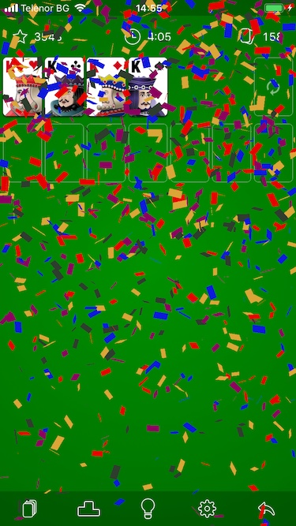

# MetalEffects

This framework provides out of the box effects for your iOS app or game. The framework uses Metal API so it only runs on iOS devices with Metal support (all devices equipped with A7 processors or higher)

**NOTE:** Metal is not supported in the Simulator so you need real device.

## Features

- [x] Confetti effect

<p align="left" >
  
</p>

## Requirements

- iOS 9.0 or later
- Xcode 9.4 or later
- iOS device with Metal support, i.e. with A7 processor or higher

## How to use

```swift
import MetalEffects

// EffectsManager is the main class to work with
let effectsManager = EffectsManager()

// The effect is rendered in a custom UIView so you need to add this view to your view hierarchy
addSubview(effectsManager.view!)

// Show the effect (currently only Confetti is supported)
effectsManager.show(effectType: .confetti(configuration: .default)) { result in
   // TODO: Handle completion of the effect
}
```

## Instalation

There are two ways to use MetalEffects in your project:
- using Carthage
- manual by cloning the project into your repository


### Installation with Carthage (iOS 8+)

[Carthage](https://github.com/Carthage/Carthage) is a lightweight dependency manager for Swift and Objective-C. It leverages CocoaTouch modules and is less invasive than CocoaPods.

To install with carthage, follow the instruction on [Carthage](https://github.com/Carthage/Carthage)

#### Cartfile
```
github "plamenterziev/MetalEffects"
```

### Installation by cloning the repository

Clone the repository and link the MetalEffects.xcodeproj as subproject (see the Example app)

## Author

- [Plamen Terziev](https://github.com/plamenterziev)

## Showcase

This framework is used in [Solitaire The Game](https://itunes.apple.com/us/app/solitaire-the-game/id1251359095?mt=8) which is featured in the article [World of Solitaire](https://topgamescenter.com/world-of-solitaire/) of [TopGamesCenter](https://topgamescenter.com)

## TODO

- Add more effects
